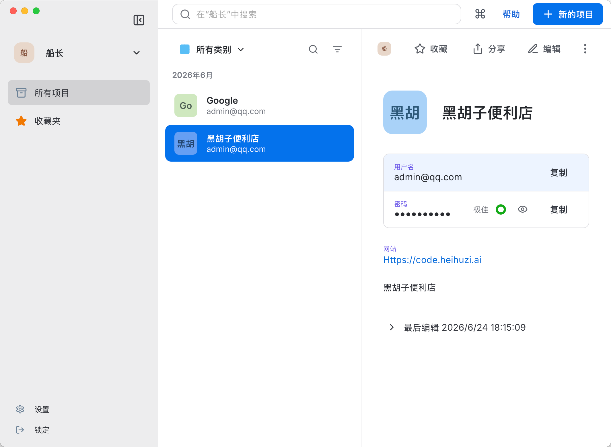
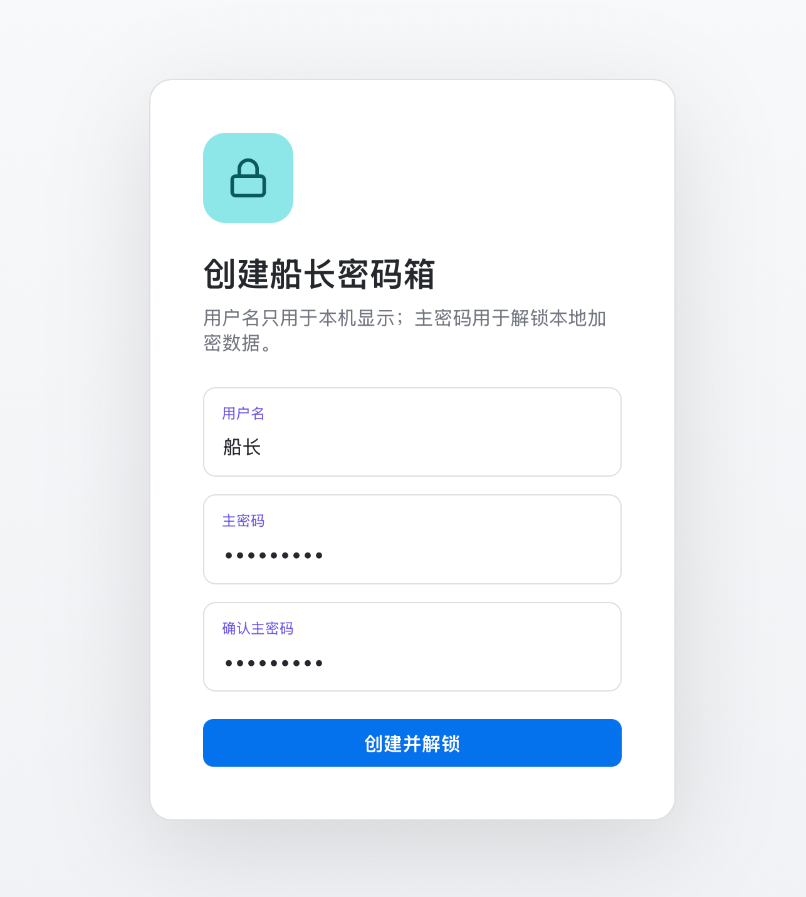
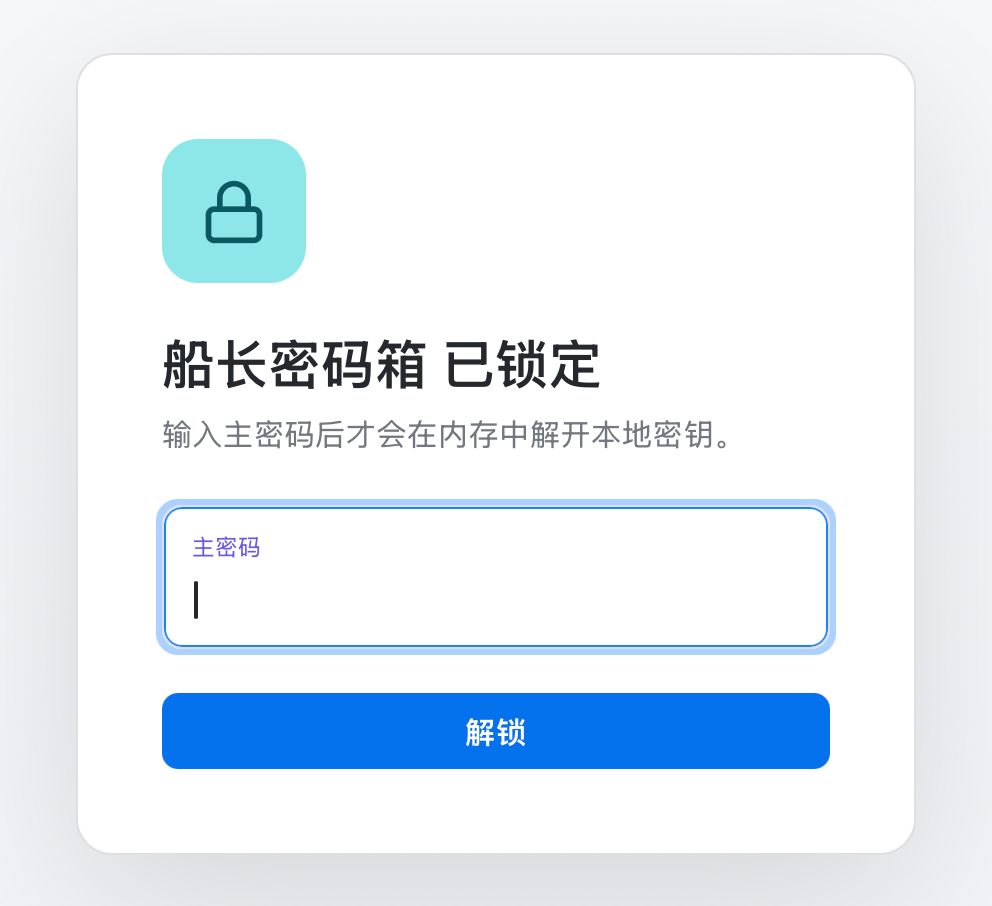
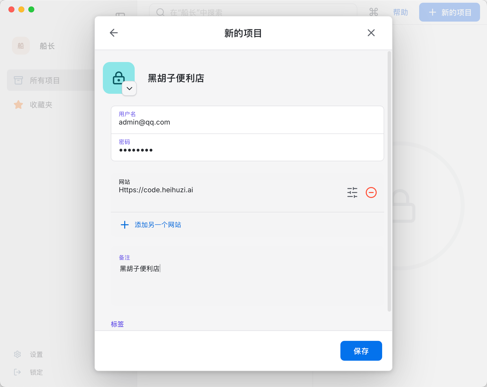
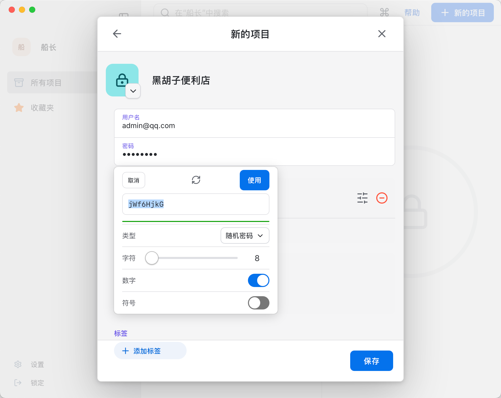
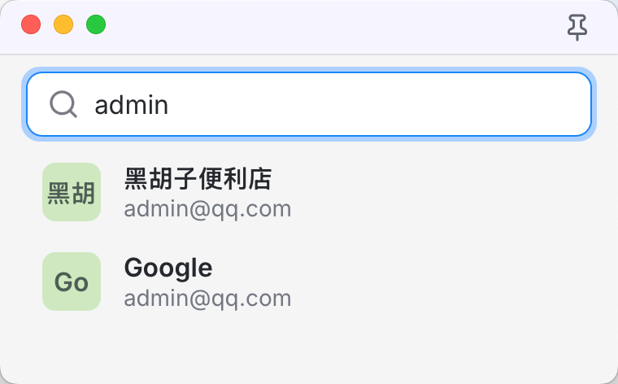
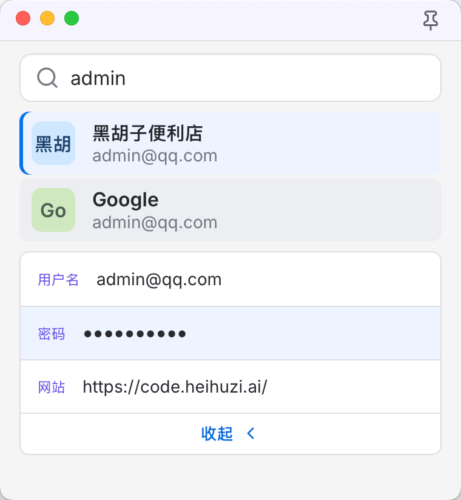

<div align="center">


# 船长密码箱 · Captain Password

只存在自己电脑上的密码管理器。一个主密码解锁，按一下快捷键就能搜到、复制走。

简体中文 · [English](README.en.md)

<a href="https://github.com/heihuzi-labs/captain-password/releases/latest"></a>


</div>



## 这是什么

密码记在浏览器里怕丢，记在云端密码服务里又总觉得不踏实，还得按月付钱。船长密码箱走另一条路：保险库就是本机上的一个加密文件，不注册账号、不上传、不联网同步，打开时输入主密码才解得开。

平时最常用的动作是“登录某个网站，找到密码，复制”。所以除了主窗口，它还有一个迷你查询窗口：在哪儿都能按 `Option + K`（Windows 上是 `Alt + K`）叫出来，输两个字搜到，点一下就复制，不用在浏览器和主窗口之间来回切。

## 看一眼

<table>
<tr>
<td width="50%"><br><sub>第一次打开：起个名字，设一个主密码</sub></td>
<td width="50%"><br><sub>之后每次打开先解锁，主密码不对就什么也看不到</sub></td>
</tr>
<tr>
<td><br><sub>编辑：用户名、密码、多个网站、备注、标签</sub></td>
<td><br><sub>密码生成器：长度、要不要数字和符号，满意了点“使用”</sub></td>
</tr>
<tr>
<td><br><sub>迷你查询窗口：快捷键叫出来，边输边搜</sub></td>
<td><br><sub>选中一条，点用户名、密码或网站就复制走</sub></td>
</tr>
</table>

## 能做什么

- **登录信息和密码**：标题、用户名、密码、网站（可以填好几个）、备注、标签、图标；也可以只存一个单独的密码。
- **找和用**：搜索、收藏、按类别筛选，任何字段一键复制。
- **生成密码**：随机密码、好记的密码或 PIN 码，长度和字符类型可调，旁边会标出密码强度。
- **迷你查询窗口**：全局快捷键叫出，可以钉在最前面。

新建时还能看到安全备注、信用卡、身份标识、文档这几种，标着“后续”，现在还不能用。

## 安装

到 [Releases](https://github.com/heihuzi-labs/captain-password/releases/latest) 下载：

| 系统 | 文件 |
| --- | --- |
| Mac（苹果芯片） | `CaptainPassword-v…-macOS-AppleSilicon.dmg` |
| Mac（英特尔芯片） | `CaptainPassword-v…-macOS-Intel.dmg` |
| Windows 64 位 | `CaptainPassword-v…-Windows-x64-Setup.exe` |

安装包没有做苹果和微软的开发者签名。Mac 上第一次打开如果提示“无法验证开发者”，在“系统设置 → 隐私与安全性”里点“仍要打开”；Windows 上如果弹出蓝色的保护提示，点“更多信息 → 仍要运行”。

应用会自己检查有没有新版本，有的话提示你去下载。

## 数据和安全

- 保险库存在本机的一个 SQLite 文件里，密码这些敏感内容都是加密后才写进去的。
- 主密码用 Argon2id 算出密钥，内容用 XChaCha20-Poly1305 加密；锁定后内存里的密钥会被清掉。
- 主密码不会存在任何地方，忘了就找不回来，这是本地密码箱的代价。
- 数据不会离开这台电脑。唯一的联网动作是检查新版本：向 GitHub 查询最新版本号。

说实话，它还是个早期的个人项目，没有经过第三方安全审计。放真正重要的密码之前，请先自己用一段时间，并且记得备份。

发现安全问题，请走 GitHub 的 Security Advisories 私下告诉我们，别开公开 issue。

## 自己编译

需要 Node.js 22 和 Rust。

```sh
git clone https://github.com/heihuzi-labs/captain-password.git && cd captain-password
npm ci
npm run tauri dev          # 开发版
npm run tauri -- build     # 打包
```

用的是 Tauri 2（Rust 后端）+ React 18 + TypeScript + Vite。推一个 `v*` 标签，GitHub Actions 会自动打出三个平台的安装包并发到 Releases，见 [.github/workflows/release.yml](.github/workflows/release.yml)。当初怎么拆解密码管理器、怎么定第一版范围，记在 [ANALYSIS.md](ANALYSIS.md)。

## 许可证

[MIT](LICENSE)。安装包和应用里的英文名是 `CaptainPassword`，这是为了让各平台的文件名保持稳定。

---

<sub>船长系列，来自 [heihuzi-labs](https://github.com/heihuzi-labs)：[船长派活](https://github.com/heihuzi-labs/captain-agents) · [船长 K8s](https://github.com/heihuzi-labs/captain-kube) · [船长运维](https://github.com/heihuzi-labs/captain-ops) · **船长密码箱** · [船长待办](https://github.com/heihuzi-labs/captain-todo)</sub>
